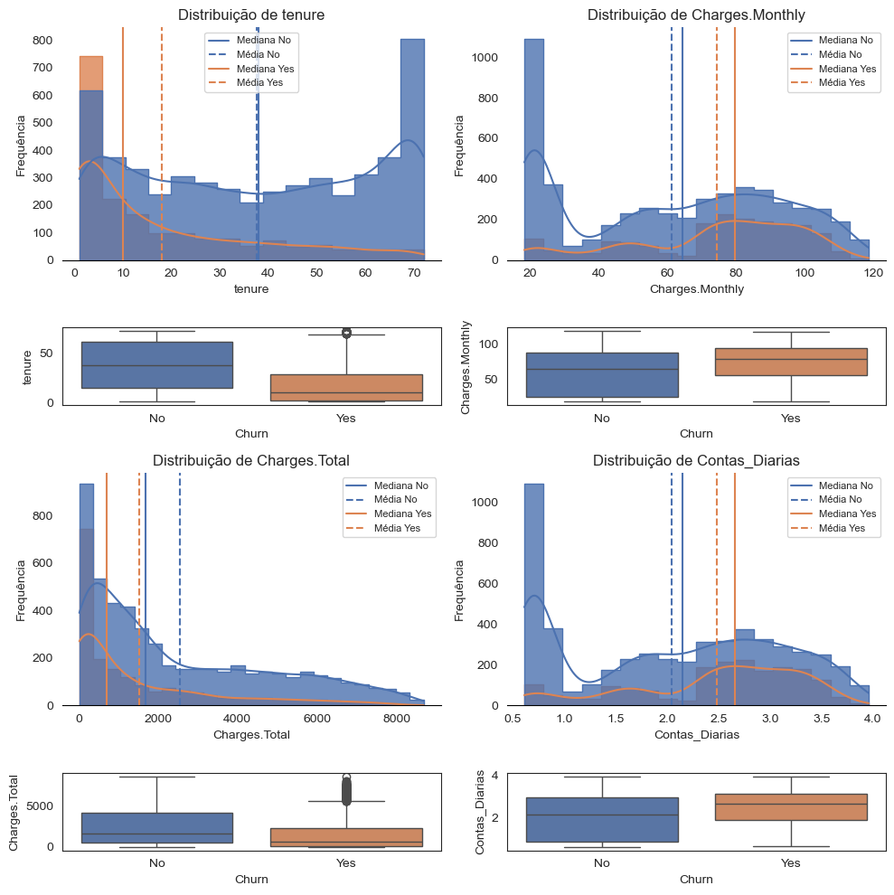

# 📊 Análise de Evasão de Clientes (Churn) da TelecomX_BR

Este projeto faz parte do programa ONE (Oracle Next Education) G8 BR Data Science, parceria entre a Alura e a Oracle, e tem como objetivo analisar o comportamento dos clientes de uma empresa de telecomunicações, buscando entender os fatores que influenciam o cancelamento de serviços (Churn). Através de análise estatística, visualização de dados e interpretação de padrões, propomos insights e recomendações para mitigar a evasão de clientes.

---

## 🔍 Objetivo

Investigar os principais fatores que contribuem para a evasão de clientes, utilizando dados históricos da base de clientes. A análise busca responder às seguintes perguntas:

- Quem são os clientes que mais cancelam?
- Quais características estão mais associadas ao churn?
- Como podemos prever e prevenir futuros cancelamentos?

---

## 🧮 Tecnologias Utilizadas

- Python 3.12.7
- Jupyter Notebook
- Bibliotecas: 
  - `pandas`, `numpy` para tratamento de dados
  - `matplotlib`, `seaborn`, `plotly` para visualizações

---

## 📁 Estrutura do Projeto

```
📦 churn-analysis
 ┣ 📊 app.ipynb
 ┣ 📈 histograma.png
 ┣ 📑 README.md
```

- `app.ipynb`: notebook com todo o processo de análise.
- `histograma.png`: Distribuição das variáveis numéricas com relação a Churn.
- `README.md`: este documento.

---

## 🧼 Limpeza e Tratamento dos Dados

- Conversão de colunas categóricas e numéricas.
- Remoção e substituição de dados nulos.
- Criação de variáveis derivadas como `Contas_Diarias`.
- Correção de tipos e consistência.

---

## 📊 Análise Exploratória

A análise utilizou gráficos de barras e setores, histogramas e boxplots para examinar:

- Diferenças entre clientes com e sem churn
- Padrões em variáveis como:
  - Tipo de contrato
  - Método de pagamento
  - Serviços extras (streaming, segurança, suporte)
  - Gênero e idade

**Histogramas e Boxplots:** 

---

## 📌 Principais Insights

- **Contrato mensal** está fortemente associado ao churn (~43%).
- **Clientes com serviços de segurança ou suporte técnico** tendem a permanecer mais.
- **Cheque eletrônico** é o método de pagamento com maior churn (~45%).
- Clientes **idosos**, com **internet via fibra óptica** e **cobranças mensais altas** também apresentam maior risco de evasão.
- Clientes que permanecem por menos de **6 meses** ou que têm **baixo uso diário** são mais propensos ao cancelamento.

---

## ✅ Recomendação Estratégica

1. **Incentivar contratos de longo prazo** com descontos e benefícios.
2. **Oferecer suporte técnico gratuito** por tempo limitado a novos clientes.
3. **Acompanhar os clientes nos primeiros 6 meses**, oferecendo onboarding e canais de comunicação direta.
4. **Substituir o método de pagamento por opções automáticas**, como cartão ou débito.
5. **Monitorar o uso diário** para identificar clientes com baixo engajamento.

---

## 📌 Conclusão

O projeto fornece uma base sólida de entendimento sobre os motivos do churn e oferece subsídios para ações preventivas. Essa análise pode ser expandida com modelos preditivos para antecipar cancelamentos e direcionar ações mais eficazes.

---

## 👤 Autor

Desenvolvido por Müller Pereira  
📧 Email: mullerpereira94@gmail.com  
📎 GitHub: [github.com/muller-pereira](https://github.com/muller-pereira)

---

## 📝 Licença

Este projeto está licenciado sob a [MIT License](LICENSE).
